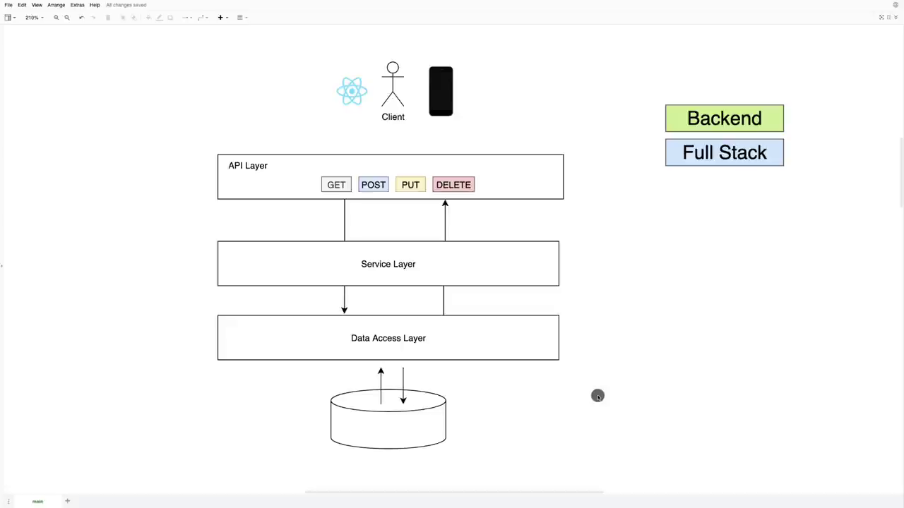
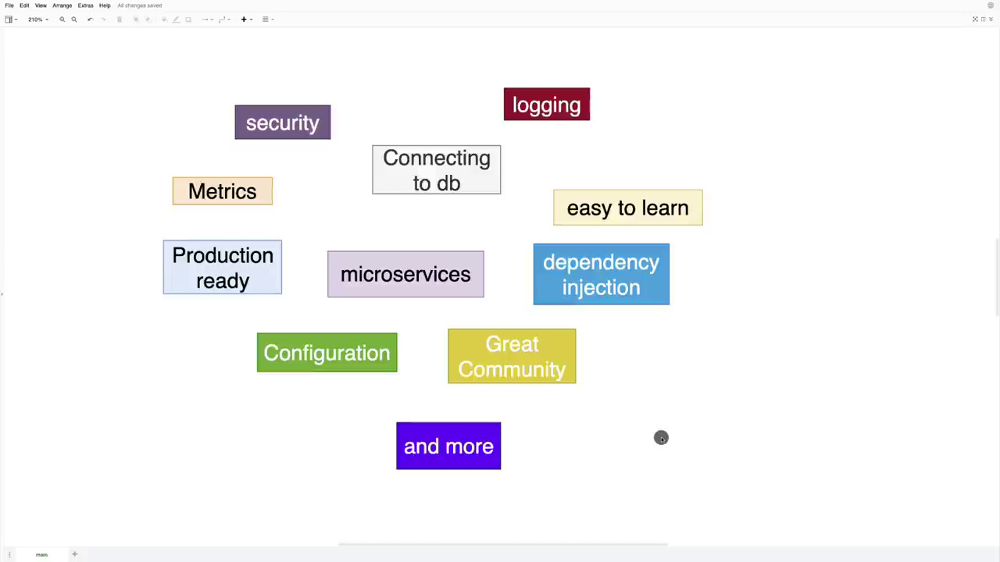

# Learn Spring Boot

## Overview

### Layers

### It gives you everything you need

## Project Overview

-   api layer
    1. get
    2. post
    3. put
    4. delete
-   service layer
-   data access layer
-   DB

## Spring Initializr

