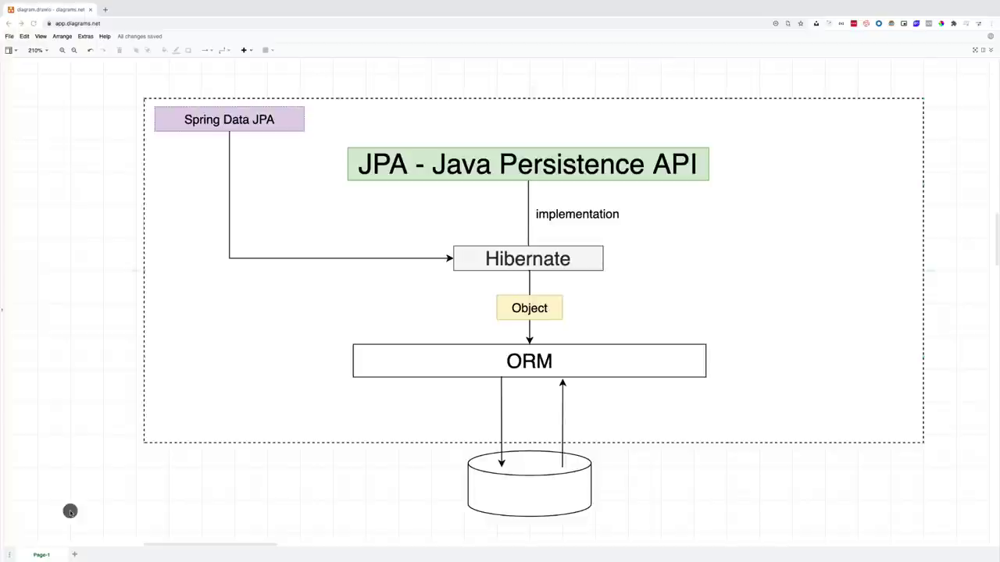

# Spring Data JPA

## Course Description

- What is Spring Data JPA
- Connect to a real database and not in memory DB
- how to map classes two tables
- Hibernate entity life cycle
- Queries
- paging in sorting
- 1 to 1 relationships
- to many relationships
- many to many relationships
- transactions

## JPA and Spring Data JPA

