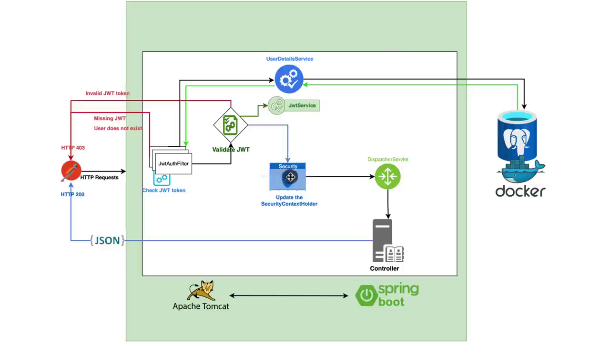

# Spring Boot 3 Security + JWT

## Intro



Anytime and each time you create a Filter, just noticed and remember that it would be the first thing to be executed in the application.

## User class

```java
package com.example.jwtdemo.user;

import jakarta.persistence.*;
import lombok.AllArgsConstructor;
import lombok.Builder;
import lombok.Data;
import lombok.NoArgsConstructor;

@Entity(name = "User")
@Table(name = "")
@Data
@Builder
@NoArgsConstructor
@AllArgsConstructor
public class User {
    @Id
    @GeneratedValue
    private Integer id;
    private String firstName;
    private String lastName;
    private String email;
    private String password;
}
```

### `@Builder` annotation provides builder api  

***Tips: Builder Pattern***
<div style="margin:5px;padding:20px;border:2px solid purple">
<b>ChatGPT-3.5:</b><br>
The builder pattern is a creational design pattern used in object-oriented programming to construct complex objects with a step-by-step approach. It provides a way to construct a product with a variety of configurations while keeping the construction process clean and readable. The builder pattern is particularly useful when an object has a large number of parameters, and it's not practical to have a constructor with an exhaustive list of parameters.

Key components of the builder pattern include:

1. **Product:**
   - The complex object that we want to build.

2. **Builder:**
   - An abstract interface or class that declares the steps required to construct the product.

3. **ConcreteBuilder:**
   - A concrete implementation of the builder interface or class that provides specific implementations for constructing the product.

4. **Director:**
   - An optional class that orchestrates the construction process using a builder. The director is responsible for defining the construction steps in a specific order.

Here is a simple example of the builder pattern in Java:

```java
// Product
class Product {
    private String part1;
    private String part2;

    public void setPart1(String part1) {
        this.part1 = part1;
    }

    public void setPart2(String part2) {
        this.part2 = part2;
    }

    @Override
    public String toString() {
        return "Product{part1='" + part1 + "', part2='" + part2 + "'}";
    }
}

// Builder
interface Builder {
    void buildPart1(String part1);

    void buildPart2(String part2);

    Product getResult();
}

// ConcreteBuilder
class ConcreteBuilder implements Builder {
    private Product product = new Product();

    @Override
    public void buildPart1(String part1) {
        product.setPart1(part1);
    }

    @Override
    public void buildPart2(String part2) {
        product.setPart2(part2);
    }

    @Override
    public Product getResult() {
        return product;
    }
}

// Director
class Director {
    public void construct(Builder builder) {
        builder.buildPart1("A");
        builder.buildPart2("B");
    }
}

// Client
public class BuilderPatternExample {
    public static void main(String[] args) {
        Director director = new Director();
        Builder builder = new ConcreteBuilder();

        director.construct(builder);
        Product product = builder.getResult();

        System.out.println("Constructed Product: " + product);
    }
}
```

In this example, the `Product` class is the object to be constructed. The `Builder` interface declares the steps required to build the product, and `ConcreteBuilder` provides specific implementations for constructing the product. The `Director` class orchestrates the construction process, and the client code demonstrates how to use the builder pattern to create a complex object step by step.
</div>

### @GeneratedValue: auto strategies choose strategy for you

```yaml
spring:
    datasource:
        url: jdbc:postgresql://localhost:5432/jwt_security
        username: huntley
        password:
        driver-class-name: org.postgresql.Driver
    jpa:
        hibernate:
            ddl-auto: create-drop
        show-sql: true
        properties:
            hibernate:
                format_sql: true
                globally_quoted_identifiers: true
            database: postgresql
            database-platform: org.hibernate.dialect.postgreSQLDialect
```

`globally_quoted_identifiers: true`: add quotes for sql identifiers.

**Run:**

```terminal
WARN 84539 --- [  restartedMain] o.h.engine.jdbc.spi.SqlExceptionHelper   : sequence "user_seq" does not exist, skipping
Hibernate: create sequence "user_seq" start with 1 increment by 50
Hibernate: 
    
    create table "user" (
       "id" integer not null,
        "email" varchar(255),
        "first_name" varchar(255),
        "last_name" varchar(255),
        "password" varchar(255),
        primary key ("id")
    )
```

### Security Generate password

```terminal
2024-02-08T04:30:18.404+08:00  INFO 84539 --- [  restartedMain] o.h.e.t.j.p.i.JtaPlatformInitiator       : HHH000490: Using JtaPlatform implementation: [org.hibernate.engine.transaction.jta.platform.internal.NoJtaPlatform]
2024-02-08T04:30:18.413+08:00  INFO 84539 --- [  restartedMain] j.LocalContainerEntityManagerFactoryBean : Initialized JPA EntityManagerFactory for persistence unit 'default'
2024-02-08T04:30:18.480+08:00  WARN 84539 --- [  restartedMain] JpaBaseConfiguration$JpaWebConfiguration : spring.jpa.open-in-view is enabled by default. Therefore, database queries may be performed during view rendering. Explicitly configure spring.jpa.open-in-view to disable this warning
2024-02-08T04:30:18.901+08:00  WARN 84539 --- [  restartedMain] .s.s.UserDetailsServiceAutoConfiguration : 

Using generated security password: e4355861-9cc4-4c5e-a123-cbbe0528c67b

This generated password is for development use only. Your security configuration must be updated before running your application in production.

2024-02-08T04:30:19.025+08:00  INFO 84539 --- [  restartedMain] o.s.s.web.DefaultSecurityFilterChain     : Will secure any request with [org.springframework.security.web.session.DisableEncodeUrlFilter@3210d546, org.springframework.security.web.context.request.async.WebAsyncManagerIntegrationFilter@566d853c, org.springframework.security.web.context.SecurityContextHolderFilter@3cc574dd, org.springframework.security.web.header.HeaderWriterFilter@30a8a3df, org.springframework.security.web.csrf.CsrfFilter@570fdf85, org.springframework.security.web.authentication.logout.LogoutFilter@2f4e7489, org.springframework.security.web.authentication.UsernamePasswordAuthenticationFilter@28a40f41, org.springframework.security.web.authentication.ui.DefaultLoginPageGeneratingFilter@4a5a9bb8, org.springframework.security.web.authentication.ui.DefaultLogoutPageGeneratingFilter@63ec771, org.springframework.security.web.authentication.www.BasicAuthenticationFilter@77226767, org.springframework.security.web.savedrequest.RequestCacheAwareFilter@3685244c, org.springframework.security.web.servletapi.SecurityContextHolderAwareRequestFilter@323cf63c, org.springframework.security.web.authentication.AnonymousAuthenticationFilter@244ce887, org.springframework.security.web.access.ExceptionTranslationFilter@4d708624, org.springframework.security.web.access.intercept.AuthorizationFilter@9728039]
2024-02-08T04:30:19.079+08:00
```

## Create User class

```java
package com.example.jwtdemo.user;

import java.util.Collection;
import java.util.List;
import org.springframework.security.core.GrantedAuthority;
import org.springframework.security.core.authority.SimpleGrantedAuthority;
import org.springframework.security.core.userdetails.UserDetails;
import jakarta.persistence.*;
import lombok.AllArgsConstructor;
import lombok.Builder;
import lombok.Data;
import lombok.NoArgsConstructor;

@Entity(name = "User")
@Table(name = "user")
@Data
@Builder
@NoArgsConstructor
@AllArgsConstructor
public class User implements UserDetails {
    @Id
    @GeneratedValue
    private Integer id;
    private String firstName;
    private String lastName;
    private String email;
    private String password;

    @Enumerated(EnumType.STRING)
    private Role role;

    @Override
    public Collection<? extends GrantedAuthority> getAuthorities() {
        return List.of(new SimpleGrantedAuthority(role.name()));
    }

    @Override
    public String getUsername() {
        return email;
    }

    @Override
    public boolean isAccountNonExpired() {
        return true;
    }

    @Override
    public boolean isAccountNonLocked() {
        return true;
    }

    @Override
    public boolean isCredentialsNonExpired() {
        return true;
    }

    @Override
    public boolean isEnabled() {
        return true;
    }

    @Override
    public String getPassword() {
        return password;
    }
}
```

### UserDetails

In `package org.springframework.security.core.userdetails;`,
`public interface UserDetails extends Serializable`  
`public class User implements UserDetails, CredentialsContainer`  

### `@Enumerated(EnumType.STRING)`

define enum type.

### override `getPassword()`

in `UserDetails`:

```java
/**
  * Returns the password used to authenticate the user.
  * @return the password
  */
 String getPassword();
```

In case we have a `password` field, then we used lombok `@AllArgsConstructor`, it didn't auto generate override method. We need to manually override this method.  

### implements `UserDetails`

- Collection<? extends GrantedAuthority> getAuthorities();
- `String getPassword();`
- `String getUsername();`
- `boolean isAccountNonExpired();`
- `boolean isAccountNonLocked();`
- `boolean isCredentialsNonExpired();`
- `boolean isEnabled();`

## Create UserRepository

```java
package com.example.jwtdemo.user;

import java.util.Optional;
import org.springframework.data.jpa.repository.JpaRepository;

public interface UserRepository extends JpaRepository<User, Integer> {
    Optional<User> findByEmail(String email);
}
```

## Create JWT Filter

```java
package com.example.jwtdemo.config;

import java.io.IOException;
import org.springframework.lang.NonNull;
import org.springframework.security.core.userdetails.UserDetailsService;
import org.springframework.stereotype.Component;
import org.springframework.web.filter.OncePerRequestFilter;
import jakarta.servlet.FilterChain;
import jakarta.servlet.ServletException;
import jakarta.servlet.http.HttpServletRequest;
import jakarta.servlet.http.HttpServletResponse;
// import lombok.NonNull;
import lombok.RequiredArgsConstructor;

@Component
@RequiredArgsConstructor
public class JwtAuthenticationFilter extends OncePerRequestFilter {
    private final UserDetailsService userDetailsService;

    @Override
    protected void doFilterInternal(
            @NonNull HttpServletRequest request,
            @NonNull HttpServletResponse response,
            @NonNull FilterChain filterChain)
            throws ServletException, IOException {
        final String authHeader = request.getHeader("Authorization");
        final String jwt;
        if (authHeader == null || !authHeader.startsWith("Bearer ")) {
            filterChain.doFilter(request, response);
            return;
        }
        jwt = authHeader.substring(7);
    }

}
```

### `extends OncePerRequestFilter`

### implementation

```java
@Override
    protected void doFilterInternal(HttpServletRequest request,
            HttpServletResponse response, FilterChain filterChain)
            throws ServletException, IOException {
        
    }
```

Three parameters:

- HttpServletRequest request
- HttpServletResponse response
- FilterChain filterChain

### FilterChain pattern

**ChatGPT-3.5:**
<div style="margin:5px;padding:20px;border:2px solid purple">
The Filter Chain design pattern is a behavioral pattern that allows multiple filters to process a request or response in a chain-like manner. Each filter in the chain is responsible for a specific aspect of the processing, and the request or response is passed through the chain.

Here is a simple example of the Filter Chain design pattern in Java. In this example, let's consider a scenario where we have a set of filters to process a request:

```java
// Step 1: Define the Request and Response objects
class Request {
    private String data;

    public Request(String data) {
        this.data = data;
    }

    public String getData() {
        return data;
    }
}

class Response {
    private String data;

    public String getData() {
        return data;
    }

    public void setData(String data) {
        this.data = data;
    }
}

// Step 2: Define the Filter interface
interface Filter {
    void execute(Request request, Response response, FilterChain chain);
}

// Step 3: Implement concrete filters
class AuthenticationFilter implements Filter {
    @Override
    public void execute(Request request, Response response, FilterChain chain) {
        System.out.println("Authenticating the request");
        chain.doFilter(request, response);
    }
}

class LoggingFilter implements Filter {
    @Override
    public void execute(Request request, Response response, FilterChain chain) {
        System.out.println("Logging the request");
        chain.doFilter(request, response);
        System.out.println("Logging the response");
    }
}

class ValidationFilter implements Filter {
    @Override
    public void execute(Request request, Response response, FilterChain chain) {
        System.out.println("Validating the request");
        chain.doFilter(request, response);
    }
}

// Step 4: Define the Filter Chain
class FilterChain {
    private List<Filter> filters = new ArrayList<>();
    private int index = 0;

    public void addFilter(Filter filter) {
        filters.add(filter);
    }

    public void doFilter(Request request, Response response) {
        if (index < filters.size()) {
            Filter filter = filters.get(index);
            index++;
            filter.execute(request, response, this);
        }
    }
}

// Step 5: Use the Filter Chain
public class Main {
    public static void main(String[] args) {
        FilterChain filterChain = new FilterChain();
        filterChain.addFilter(new AuthenticationFilter());
        filterChain.addFilter(new LoggingFilter());
        filterChain.addFilter(new ValidationFilter());

        Request request = new Request("Some data");
        Response response = new Response();

        filterChain.doFilter(request, response);
    }
}
```

In this example, we have a `Filter` interface with a method `execute`. Concrete filters (`AuthenticationFilter`, `LoggingFilter`, and `ValidationFilter`) implement this interface. The `FilterChain` class is responsible for maintaining the order of filters and executing them one by one.

When you run this example, you'll see the output:

```output
Authenticating the request
Logging the request
Validating the request
Logging the response
```

This demonstrates how each filter in the chain processes the request or response, and the control flows through the chain accordingly.
</div>

Notice: call execute on a filter passed filterChain along with its index as parameter, so the stack will have an end.

### Use Spring @NonNull annotation in spring project

### Use @RequiredConstructor annotation for final fields

## JwtService class

### signingKey

Make sure the client who sent the request is who he claims who he is.

### parseClaims

```java
    public <T> T extractClaim(String token, Function<Claims, T> claimsResolver) {
        final Claims claims = extractAllClaims(token);
        return claimsResolver.apply(claims);
    }

    public String extractUsername(String token) {
        return extractClaim(token, Claims::getSubject);
    }

    private Claims extractAllClaims(String token) {
        // return Jwts.parserBuilder().setSigningKey(getSignInKey())
        // .build().parseClaimsJws(token).getBody();
        return Jwts.parser().verifyWith(getSignInKey()).build().parseSignedClaims(token)
                .getPayload();
    }

    private SecretKey getSignInKey() {
        byte[] keyBytes = Decoders.BASE64.decode(SECRETE_KEY);
        return Keys.hmacShaKeyFor(keyBytes);
    }
```

### Generate Token

```java
    public String generateToken(UserDetails userDetails) {
        return generateToken(new HashMap<>(), userDetails);
    }

    public String generateToken(Map<String, Object> extractClaims, UserDetails userDetails) {
        return Jwts.builder().claims(extractClaims).subject(userDetails.getUsername())
                .issuedAt(new Date(System.currentTimeMillis()))
                .expiration(new Date(System.currentTimeMillis() + 1000 * 60 * 24))
                .signWith(getSignInKey(), Jwts.SIG.HS256).compact();
    }
```

### isTokenValid

```java
    public boolean isTokenValid(String token, UserDetails userDetails) {
        final String username = extractUsername(token);
        return (username.equals(userDetails.getUsername())) && !isTokenExpired(token);
    }
    private SecretKey getSignInKey() {
        byte[] keyBytes = Decoders.BASE64.decode(SECRETE_KEY);
        return Keys.hmacShaKeyFor(keyBytes);
    }

    private boolean isTokenExpired(String token) {
        return extractExpiration(token).before(new Date());
    }

    private Date extractExpiration(String token) {
        return extractClaim(token, Claims::getExpiration);
    }
```

### finish Filter

```java
package com.example.jwtdemo.config;

import java.io.IOException;
import org.springframework.lang.NonNull;
import org.springframework.security.authentication.UsernamePasswordAuthenticationToken;
import org.springframework.security.core.context.SecurityContextHolder;
import org.springframework.security.core.userdetails.UserDetails;
import org.springframework.security.core.userdetails.UserDetailsService;
import org.springframework.security.web.authentication.WebAuthenticationDetailsSource;
import org.springframework.stereotype.Component;
import org.springframework.web.filter.OncePerRequestFilter;
import jakarta.servlet.FilterChain;
import jakarta.servlet.ServletException;
import jakarta.servlet.http.HttpServletRequest;
import jakarta.servlet.http.HttpServletResponse;
import lombok.RequiredArgsConstructor;

@Component
@RequiredArgsConstructor
public class JwtAuthenticationFilter extends OncePerRequestFilter {
    private final JwtService jwtService;
    private final UserDetailsService userDetailsService;

    @Override
    protected void doFilterInternal(@NonNull HttpServletRequest request,
            @NonNull HttpServletResponse response, @NonNull FilterChain filterChain)
            throws ServletException, IOException {
        final String authHeader = request.getHeader("Authorization");
        final String jwt;
        final String userEmail;
        if (authHeader == null || !authHeader.startsWith("Bearer ")) {
            filterChain.doFilter(request, response);
            return;
        }
        jwt = authHeader.substring(7);
        userEmail = jwtService.extractUsername(jwt);
        if (userEmail != null && SecurityContextHolder.getContext().getAuthentication() == null) {
            UserDetails userDetails = this.userDetailsService.loadUserByUsername(userEmail);
            if (jwtService.isTokenValid(jwt, userDetails)) {
                UsernamePasswordAuthenticationToken authToken =
                        new UsernamePasswordAuthenticationToken(userDetails, null,
                                userDetails.getAuthorities());
                authToken.setDetails(new WebAuthenticationDetailsSource().buildDetails(request));
                SecurityContextHolder.getContext().setAuthentication(authToken);
            }
        }
        filterChain.doFilter(request, response);
    }

}
```

## `@EnableWebSecurity`

returns FilterChain in this class.

**ChatGPT-3.5**:
<div style="margin:5px;padding:20px;border:2px solid purple">
In Spring Security, `@EnableWebSecurity` is an annotation that is used to enable web security in a Spring Boot application. This annotation is typically applied to a configuration class that extends `WebSecurityConfigurerAdapter` or implements `SecurityConfigurerAdapter`.

Here is a brief introduction to `@EnableWebSecurity` and its usage:

### Purpose of `@EnableWebSecurity`

1. **Enabling Web Security:**
   - The primary purpose of `@EnableWebSecurity` is to enable Spring Security for a web-based application.

2. **Configuration Class:**
   - This annotation is usually placed on a class annotated with `@Configuration`. The class typically extends `WebSecurityConfigurerAdapter` to provide custom security configurations.

### Example Usage

Here's an example of using `@EnableWebSecurity` in a Spring Boot application:

```java
import org.springframework.context.annotation.Bean;
import org.springframework.context.annotation.Configuration;
import org.springframework.security.config.annotation.web.configuration.EnableWebSecurity;
import org.springframework.security.config.annotation.web.configuration.EnableWebSecurity;
import org.springframework.security.config.annotation.web.configuration.WebSecurityConfigurerAdapter;

@Configuration
@EnableWebSecurity
public class SecurityConfig extends WebSecurityConfigurerAdapter {

    // Custom security configurations can be added here

    @Override
    protected void configure(HttpSecurity http) throws Exception {
        // Configure HTTP security
        http
            .authorizeRequests()
                .antMatchers("/public/**").permitAll()
                .anyRequest().authenticated()
                .and()
            .formLogin()
                .loginPage("/login")
                .permitAll()
                .and()
            .logout()
                .permitAll();
    }
}
```

In this example:

- The `@EnableWebSecurity` annotation is used to enable Spring Security for the application.
- The `SecurityConfig` class extends `WebSecurityConfigurerAdapter`, which allows you to customize the security configuration.
- The `configure(HttpSecurity http)` method is overridden to provide specific security configurations, such as defining which URLs are protected, configuring form login, and specifying logout behavior.

### Important Considerations

1. **Customization:**
   - You can customize the security configuration by overriding methods in `WebSecurityConfigurerAdapter`. Common methods to override include `configure(HttpSecurity http)`, `configure(AuthenticationManagerBuilder auth)`, and others.

2. **Order of Execution:**
   - The order of execution of the security filters is significant. Filters are applied in the order they are declared. If you have multiple `WebSecurityConfigurerAdapter` instances, make sure to control the order of their execution.

3. **Path Matching:**
   - Pay attention to path matching patterns in `antMatchers` or other configuration methods. The order of these patterns can affect the behavior of security rules.

4. **Annotations vs. XML Configuration:**
   - `@EnableWebSecurity` is part of the Java-based configuration approach provided by Spring Security. If you prefer XML-based configuration, you can use the XML configuration equivalent.

Overall, `@EnableWebSecurity` is a key annotation when working with Spring Security in a Spring Boot web application. It marks the configuration class responsible for setting up security features and allows for the customization of security rules.
</div>
