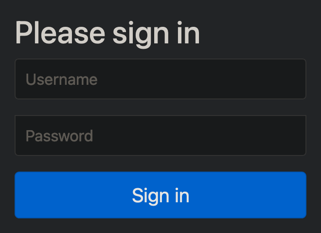
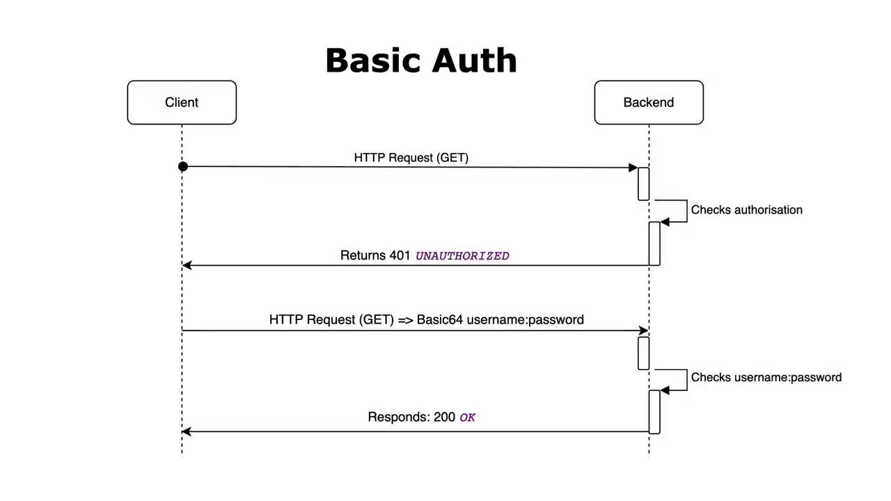

# Spring Boot Security

## Add `spring-boot-starter-security` dependency

Start the application:

```terminal
WARN 61643 --- [  restartedMain] .s.s.UserDetailsServiceAutoConfiguration : 

Using generated security password: f8166e05-f855-4e5b-880f-ad43cf4c6903

This generated password is for development use only. Your security configuration must be updated before running your application in production.

2024-02-07 21:49:47.233  INFO 61643 --- [  restartedMain] o.s.s.web.DefaultSecurityFilterChain     : Will secure any request with [org.springframework.security.web.session.DisableEncodeUrlFilter@22538fbb, org.springframework.security.web.context.request.async.WebAsyncManagerIntegrationFilter@7e3c0b20, org.springframework.security.web.context.SecurityContextPersistenceFilter@5e203b18, org.springframework.security.web.header.HeaderWriterFilter@7d8634e6, org.springframework.security.web.csrf.CsrfFilter@66e77cfe, org.springframework.security.web.authentication.logout.LogoutFilter@3b40f4d1, org.springframework.security.web.authentication.UsernamePasswordAuthenticationFilter@6f775e75, org.springframework.security.web.authentication.ui.DefaultLoginPageGeneratingFilter@1444a9b5, org.springframework.security.web.authentication.ui.DefaultLogoutPageGeneratingFilter@1b4400a4, org.springframework.security.web.authentication.www.BasicAuthenticationFilter@392cb3f2, org.springframework.security.web.savedrequest.RequestCacheAwareFilter@4b90cb5a, org.springframework.security.web.servletapi.SecurityContextHolderAwareRequestFilter@5e0180eb, org.springframework.security.web.authentication.AnonymousAuthenticationFilter@4bb6bea4, org.springframework.security.web.session.SessionManagementFilter@28b1a590, org.springframework.security.web.access.ExceptionTranslationFilter@6a00e72b, org.springframework.security.web.access.intercept.FilterSecurityInterceptor@40cafdde]
```

Start Browser:  


Default username is "user".  

- router "/login" to login
- router "/logout" to logout

### What happened

```java
// Source code is decompiled from a .class file using FernFlower decompiler.
package org.springframework.security.web;

import java.util.List;
import javax.servlet.Filter;
import javax.servlet.http.HttpServletRequest;

public interface SecurityFilterChain {
   boolean matches(HttpServletRequest request);

   List<Filter> getFilters();
}
```

#### Go to bean declaration

```java
/*
 * Copyright 2012-2022 the original author or authors.
 *
 * Licensed under the Apache License, Version 2.0 (the "License");
 * you may not use this file except in compliance with the License.
 * You may obtain a copy of the License at
 *
 *      https://www.apache.org/licenses/LICENSE-2.0
 *
 * Unless required by applicable law or agreed to in writing, software
 * distributed under the License is distributed on an "AS IS" BASIS,
 * WITHOUT WARRANTIES OR CONDITIONS OF ANY KIND, either express or implied.
 * See the License for the specific language governing permissions and
 * limitations under the License.
 */

package org.springframework.boot.autoconfigure.security.servlet;

import javax.servlet.DispatcherType;

import org.springframework.boot.autoconfigure.condition.ConditionalOnBean;
import org.springframework.boot.autoconfigure.condition.ConditionalOnClass;
import org.springframework.boot.autoconfigure.condition.ConditionalOnMissingBean;
import org.springframework.boot.autoconfigure.condition.ConditionalOnWebApplication;
import org.springframework.boot.autoconfigure.condition.ConditionalOnWebApplication.Type;
import org.springframework.boot.autoconfigure.security.ConditionalOnDefaultWebSecurity;
import org.springframework.boot.autoconfigure.security.SecurityProperties;
import org.springframework.boot.web.servlet.FilterRegistrationBean;
import org.springframework.boot.web.servlet.filter.ErrorPageSecurityFilter;
import org.springframework.context.ApplicationContext;
import org.springframework.context.annotation.Bean;
import org.springframework.context.annotation.Configuration;
import org.springframework.core.annotation.Order;
import org.springframework.security.config.BeanIds;
import org.springframework.security.config.annotation.web.builders.HttpSecurity;
import org.springframework.security.config.annotation.web.configuration.EnableWebSecurity;
import org.springframework.security.web.SecurityFilterChain;
import org.springframework.security.web.access.WebInvocationPrivilegeEvaluator;

/**
 * {@link Configuration @Configuration} class securing servlet applications.
 *
 * @author Madhura Bhave
 */
@Configuration(proxyBeanMethods = false)
@ConditionalOnWebApplication(type = Type.SERVLET)
class SpringBootWebSecurityConfiguration {

 /**
  * The default configuration for web security. It relies on Spring Security's
  * content-negotiation strategy to determine what sort of authentication to use. If
  * the user specifies their own {@code WebSecurityConfigurerAdapter} or
  * {@link SecurityFilterChain} bean, this will back-off completely and the users
  * should specify all the bits that they want to configure as part of the custom
  * security configuration.
  */
 @Configuration(proxyBeanMethods = false)
 @ConditionalOnDefaultWebSecurity
 static class SecurityFilterChainConfiguration {

  @Bean
  @Order(SecurityProperties.BASIC_AUTH_ORDER)
  SecurityFilterChain defaultSecurityFilterChain(HttpSecurity http) throws Exception {
   http.authorizeRequests().anyRequest().authenticated();
   http.formLogin();
   http.httpBasic();
   return http.build();
  }

 }

 /**
  * Configures the {@link ErrorPageSecurityFilter}.
  */
 @Configuration(proxyBeanMethods = false)
 @ConditionalOnClass(WebInvocationPrivilegeEvaluator.class)
 @ConditionalOnBean(WebInvocationPrivilegeEvaluator.class)
 static class ErrorPageSecurityFilterConfiguration {

  @Bean
  FilterRegistrationBean<ErrorPageSecurityFilter> errorPageSecurityFilter(ApplicationContext context) {
   FilterRegistrationBean<ErrorPageSecurityFilter> registration = new FilterRegistrationBean<>(
     new ErrorPageSecurityFilter(context));
   registration.setDispatcherTypes(DispatcherType.ERROR);
   return registration;
  }

 }

 /**
  * Adds the {@link EnableWebSecurity @EnableWebSecurity} annotation if Spring Security
  * is on the classpath. This will make sure that the annotation is present with
  * default security auto-configuration and also if the user adds custom security and
  * forgets to add the annotation. If {@link EnableWebSecurity @EnableWebSecurity} has
  * already been added or if a bean with name
  * {@value BeanIds#SPRING_SECURITY_FILTER_CHAIN} has been configured by the user, this
  * will back-off.
  */
 @Configuration(proxyBeanMethods = false)
 @ConditionalOnMissingBean(name = BeanIds.SPRING_SECURITY_FILTER_CHAIN)
 @ConditionalOnClass(EnableWebSecurity.class)
 @EnableWebSecurity
 static class WebSecurityEnablerConfiguration {

 }

}
```

There's a `HttpSecurity http`. Then:  

```java
http.authorizeRequests().anyRequest().authenticated();
```

This is securing all endpoints

#### If go to implementation

```java
// Source code is decompiled from a .class file using FernFlower decompiler.
package org.springframework.security.web;

import java.util.ArrayList;
import java.util.Arrays;
import java.util.List;
import javax.servlet.Filter;
import javax.servlet.http.HttpServletRequest;
import org.apache.commons.logging.Log;
import org.apache.commons.logging.LogFactory;
import org.springframework.core.log.LogMessage;
import org.springframework.security.web.util.matcher.RequestMatcher;

public final class DefaultSecurityFilterChain implements SecurityFilterChain {
   private static final Log logger = LogFactory.getLog(DefaultSecurityFilterChain.class);
   private final RequestMatcher requestMatcher;
   private final List<Filter> filters;

   public DefaultSecurityFilterChain(RequestMatcher requestMatcher, Filter... filters) {
      this(requestMatcher, Arrays.asList(filters));
   }

   public DefaultSecurityFilterChain(RequestMatcher requestMatcher, List<Filter> filters) {
      if (filters.isEmpty()) {
         logger.info(LogMessage.format("Will not secure %s", requestMatcher));
      } else {
         logger.info(LogMessage.format("Will secure %s with %s", requestMatcher, filters));
      }

      this.requestMatcher = requestMatcher;
      this.filters = new ArrayList(filters);
   }

   public RequestMatcher getRequestMatcher() {
      return this.requestMatcher;
   }

   public List<Filter> getFilters() {
      return this.filters;
   }

   public boolean matches(HttpServletRequest request) {
      return this.requestMatcher.matches(request);
   }

   public String toString() {
      return this.getClass().getSimpleName() + " [RequestMatcher=" + this.requestMatcher + ", Filters=" + this.filters + "]";
   }
}
```

## Basic Auth


The next time, client send request to the server with "username:password" format
