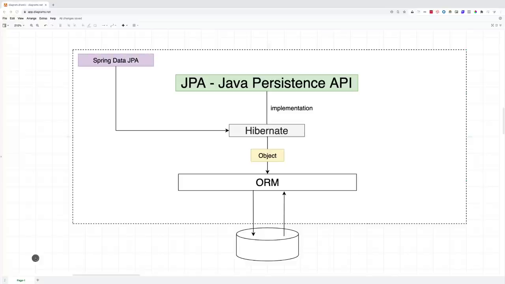
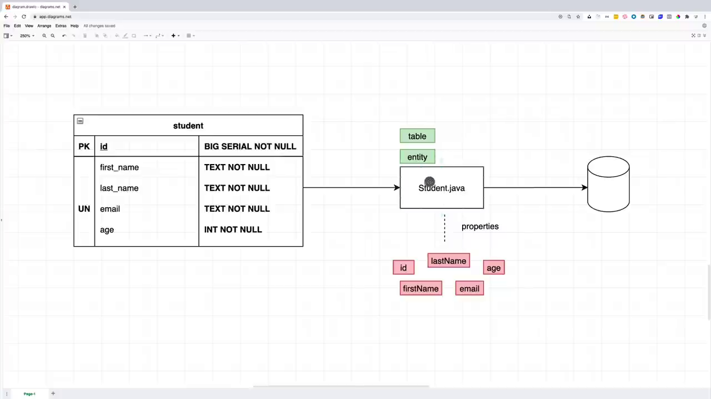
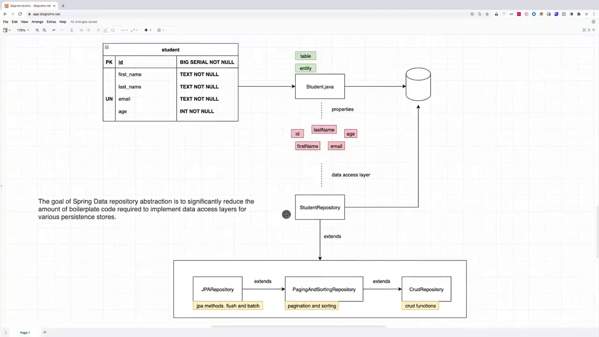

# Spring Data JPA

## Course Description

- What is Spring Data JPA
- Connect to a real database and not in memory DB
- how to map classes two tables
- Hibernate entity life cycle
- Queries
- paging in sorting
- 1 to 1 relationships
- to many relationships
- many to many relationships
- transactions

## JPA and Spring Data JPA



## ERD

### Entity

- Table name
- Constraint
- item name
- data type


## Map Entity to Table

**import jakarta/javax related packages, not hibernate**: `import javax.persistence.*;`

### `@Entity`

```java
package com.example.demo;

import javax.persistence.*;

import lombok.AllArgsConstructor;
import lombok.Data;
import lombok.NoArgsConstructor;
import lombok.ToString;

@Entity(name = "Student")
@Data
@AllArgsConstructor
@NoArgsConstructor
@ToString
public class Student {

    @Id
    @SequenceGenerator(name = "student_sequence", sequenceName = "student_sequence", allocationSize = 1)
    @GeneratedValue(strategy = GenerationType.SEQUENCE, generator = "student_sequence")
    Long id;
    private String firstName;
    private String lastName;
    private String email;
    private Integer age;

}
```

`name`: Default is the class name.  
Sometimes you have a long class but entity name is different. It's good practice to explicitly give the name of the entity.

console log:

```terminal
2024-02-07 04:33:22.618  WARN 21880 --- [           main] o.h.engine.jdbc.spi.SqlExceptionHelper   : sequence "student_sequence" does not exist, skipping
Hibernate: create sequence student_sequence start 1 increment 1
Hibernate: 
    
    create table student (
       id int8 not null,
        age int4,
        email varchar(255),
        first_name varchar(255),
        last_name varchar(255),
        primary key (id)
    )
```

You can see `student_sequence`. Call back to `BIG SERIAL` data type

```terminal
amigoscode=# \d
               List of relations
 Schema |       Name       |   Type   |  Owner  
--------+------------------+----------+---------
 public | student          | table    | huntley
 public | student_sequence | sequence | huntley
(2 rows)
```

### `@Column`

- column name
- data type
- constraints
- nullable
- etc.

```java
package com.example.demo;

import javax.persistence.*;

import lombok.AllArgsConstructor;
import lombok.Data;
import lombok.NoArgsConstructor;
import lombok.ToString;

@Entity(name = "Student")
@Data
@AllArgsConstructor
@NoArgsConstructor
@ToString
public class Student {

    @Id
    @SequenceGenerator(name = "student_sequence", sequenceName = "student_sequence",
            allocationSize = 1)
    @GeneratedValue(strategy = GenerationType.SEQUENCE, generator = "student_sequence")
    @Column(name = "id", updatable = false)
    Long id;
    
    @Column(name = "first_name", nullable = false, columnDefinition = "Text")
    private String firstName;
    
    @Column(name = "last_name", nullable = false, columnDefinition = "Text")
    private String lastName;
    
    @Column(name = "email", nullable = false, columnDefinition = "Text", unique = true)
    private String email;
    
    @Column(name = "age")
    private Integer age;

}
```

```terminal
WARN 25664 --- [           main] o.h.engine.jdbc.spi.SqlExceptionHelper   : table "student" does not exist, skipping
Hibernate: 
    
    drop sequence if exists student_sequence
2024-02-07 04:45:50.006  WARN 25664 --- [           main] o.h.engine.jdbc.spi.SqlExceptionHelper   : SQL Warning Code: 0, SQLState: 00000
2024-02-07 04:45:50.006  WARN 25664 --- [           main] o.h.engine.jdbc.spi.SqlExceptionHelper   : sequence "student_sequence" does not exist, skipping
Hibernate: create sequence student_sequence start 1 increment 1
Hibernate: 
    
    create table student (
       id int8 not null,
        age int4,
        email Text not null,
        first_name Text not null,
        last_name Text not null,
        primary key (id)
    )
Hibernate: 
    
    alter table student 
       add constraint UK_fe0i52si7ybu0wjedj6motiim unique (email)
```

## `@Table` and Constraints

- table name
- add constraints

```java
package com.example.demo;

import javax.persistence.*;

import lombok.AllArgsConstructor;
import lombok.Data;
import lombok.NoArgsConstructor;
import lombok.ToString;

@Entity(name = "Student")
@Table(name = "student",
        uniqueConstraints = {
                @UniqueConstraint(name = "student_email_unique", columnNames = "email")})
@Data
@AllArgsConstructor
@NoArgsConstructor
@ToString
public class Student {

    @Id
    @SequenceGenerator(name = "student_sequence", sequenceName = "student_sequence",
            allocationSize = 1)
    @GeneratedValue(strategy = GenerationType.SEQUENCE, generator = "student_sequence")
    @Column(name = "id", updatable = false)
    Long id;

    @Column(name = "first_name", nullable = false, columnDefinition = "Text")
    private String firstName;

    @Column(name = "last_name", nullable = false, columnDefinition = "Text")
    private String lastName;

    @Column(name = "email", nullable = false, columnDefinition = "Text")
    private String email;

    @Column(name = "age", nullable = false)
    private Integer age;

}
```

Remove unique constraint from column definition, add unique constraint at @Table. Then you see you can define the constraint's name.

```terminal
WARN 27667 --- [           main] o.h.engine.jdbc.spi.SqlExceptionHelper   : sequence "student_sequence" does not exist, skipping
Hibernate: create sequence student_sequence start 1 increment 1
Hibernate: 
    
    create table student (
       id int8 not null,
        age int4 not null,
        email Text not null,
        first_name Text not null,
        last_name Text not null,
        primary key (id)
    )
Hibernate: 
    
    alter table student 
       add constraint student_email_unique unique (email)
```

## Repository

**Repository Diagram**


```java
package com.example.demo;

import org.springframework.data.jpa.repository.JpaRepository;
import org.springframework.stereotype.Repository;

@Repository
public interface StudentRepository extends JpaRepository<Student, Long> {
    
}
```
